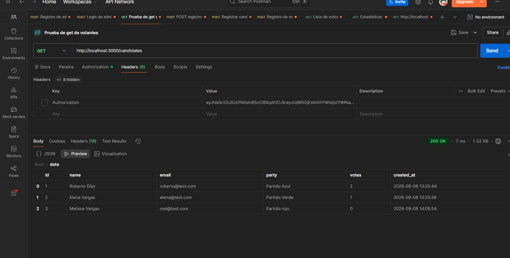
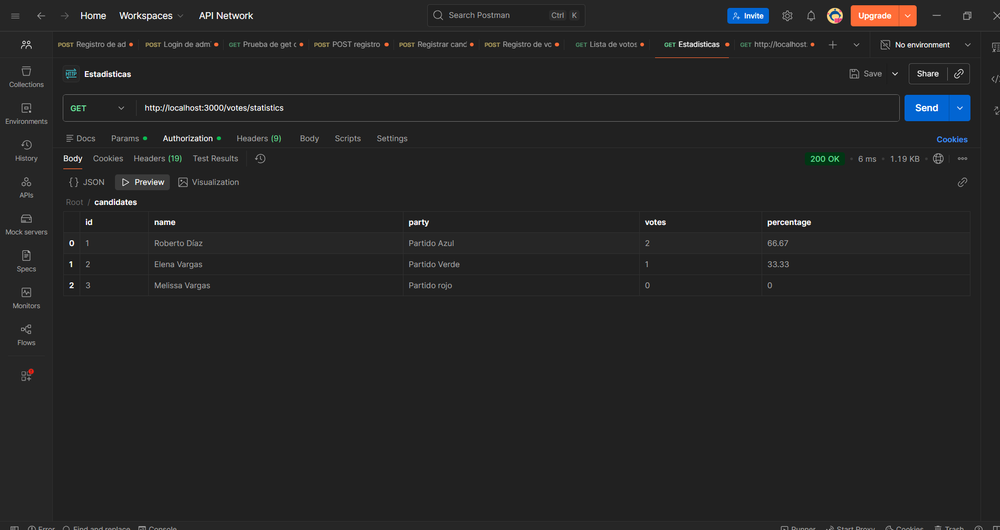

# Sistema de Votaciones — API RESTful

API RESTful para gestionar un sistema de votaciones: votantes, candidatos, emisión de votos con voto único garantizado y estadísticas de resultados. Incluye autenticación JWT.

---

## Tabla de contenidos

1. [Características](#características)
2. [Stack tecnológico](#stack-tecnológico)
3. [Requisitos](#requisitos)
4. [Instalación](#instalación)
5. [Configuración (variables de entorno)](#configuración-variables-de-entorno)
6. [Ejecución](#ejecución)
7. [Estructura del proyecto](#estructura-del-proyecto)
8. [Resumen de endpoints](#resumen-de-endpoints)
9. [Probar la API](#probar-la-api)
10. [Modelo de datos](#modelo-de-datos)
11. [Decisiones técnicas](#decisiones-técnicas)

---

## Características

- **CRUD de votantes** y **CRUD de candidatos**
- **Voto único garantizado** por votante (flag `has_voted` + constraint `UNIQUE` + transacción atómica)
- **Estadísticas**: total de votos, total de votantes que votaron, votos y porcentaje por candidato
- **Autenticación JWT** (registro + login), con contraseñas hasheadas con bcrypt
- **Validaciones robustas** con mensajes claros (400/401/404/409)
- **Paginación** en listas (`?page=` y `?limit=`)
- **Restricción cruzada**: un email no puede ser votante y candidato a la vez
- Base de datos **auto-creada** al primer arranque (sin setup manual)

## Stack tecnológico

| Capa | Tecnología |
|------|------------|
| Runtime | Node.js 18+ |
| Framework | Express |
| Base de datos | SQLite (better-sqlite3) |
| Validación | express-validator |
| Autenticación | jsonwebtoken + bcryptjs |
| Seguridad | helmet, cors |
| Configuración | dotenv |

## Requisitos

- **Node.js 18 o superior** ([descargar](https://nodejs.org))
- **npm** (incluido con Node.js)

Verificar instalación:

```bash
node --version
npm --version
```

## Instalación

```bash
# 1. Clonar el repositorio
git clone https://github.com/TU_USUARIO/voting-system.git
cd voting-system

# 2. Instalar dependencias
npm install
```

> `package-lock.json` está incluido en el repo, por lo que las versiones instaladas son exactas y reproducibles.

## Configuración (variables de entorno)

Opcional — el proyecto funciona sin `.env` usando los valores por defecto.

```bash
# Windows (PowerShell)
Copy-Item .env.example .env

# Linux / macOS
cp .env.example .env
```

| Variable | Default | Descripción |
|----------|---------|-------------|
| `PORT` | `3000` | Puerto donde escucha el servidor |
| `NODE_ENV` | `development` | Entorno de ejecución |
| `DB_PATH` | `./data/voting.db` | Ruta del archivo de base de datos |
| `JWT_SECRET` | `dev-only-insecure-secret-change-me` | Secreto para firmar tokens JWT. **Obligatorio cambiarlo en producción** |
| `JWT_EXPIRES_IN` | `8h` | Tiempo de validez del token (ej: `15m`, `2h`, `1d`) |

> ⚠️ `JWT_SECRET` es la única variable imprescindible de cambiar en producción. Usá un valor largo y aleatorio.

## Ejecución

```bash
# Producción / uso normal
npm start

# Desarrollo (auto-reload al cambiar código)
npm run dev
```

Resultado esperado:

```
[Voting API] Server running on http://localhost:3000
[Voting API] Environment: development
```

La base de datos `data/voting.db` se crea automáticamente en el primer arranque con todas las tablas (`voters`, `candidates`, `votes`, `users`).

Para detener el servidor: `Ctrl + C` en la terminal donde corre.

## Estructura del proyecto

```
voting-system/
├── docs/
│   └── API.md                  # Referencia completa de endpoints
├── src/
│   ├── index.js                # Entry point (servidor Express)
│   ├── config/
│   │   └── index.js            # Configuración (puerto, paths, JWT)
│   ├── db/
│   │   └── index.js            # Conexión SQLite + schema
│   ├── middleware/
│   │   ├── auth.js             # Verificación de token JWT
│   │   ├── errorHandler.js     # Manejo global de errores
│   │   └── validate.js         # Valida resultados de express-validator
│   └── routes/
│       ├── auth.js             # POST /auth/register y /auth/login
│       ├── voters.js           # CRUD de votantes
│       ├── candidates.js       # CRUD de candidatos
│       └── votes.js            # Emisión de votos + estadísticas
├── .env.example                # Plantilla de variables de entorno
├── .gitignore
├── package.json
└── README.md
```

## Resumen de endpoints

Base URL: `http://localhost:3000`

| Método | Ruta | Descripción | Auth |
|--------|------|-------------|------|
| POST | `/auth/register` | Crear usuario y obtener token | ❌ |
| POST | `/auth/login` | Iniciar sesión y obtener token | ❌ |
| GET | `/health` | Health check | ❌ |
| POST | `/voters` | Registrar votante | ✅ |
| GET | `/voters` | Listar votantes | ✅ |
| GET | `/voters/:id` | Detalle de votante | ✅ |
| DELETE | `/voters/:id` | Eliminar votante | ✅ |
| POST | `/candidates` | Registrar candidato | ✅ |
| GET | `/candidates` | Listar candidatos | ✅ |
| GET | `/candidates/:id` | Detalle de candidato | ✅ |
| DELETE | `/candidates/:id` | Eliminar candidato | ✅ |
| POST | `/votes` | Emitir un voto | ✅ |
| GET | `/votes` | Listar votos | ✅ |
| GET | `/votes/statistics` | Estadísticas de votación | ✅ |

Detalle completo (cuerpos, respuestas, errores): [docs/API.md](docs/API.md)

## Probar la API

La forma más rápida es con **Postman** (o curl). El flujo completo:

1. `POST /auth/register` → obtener token
2. Agregar header `Authorization: Bearer <token>` en cada request
3. Crear votantes → `POST /voters`
4. Crear candidatos → `POST /candidates`
5. Emitir votos → `POST /votes`
6. Ver estadísticas → `GET /votes/statistics`

Tutorial paso a paso y todos los ejemplos con `curl`: [docs/API.md](docs/API.md)

## Evidencia de pruebas (Postman)

Capturas reales de cada paso del flujo:

| Paso | Captura |
|------|---------|
| Registro de usuario |  |
| Login |  |
| Registro de votantes |  |
| Registro de candidatos |  |
| Emisión de votos |  |
| Lista de votos |  |
| Lista de candidatos |  |
| **Estadísticas finales** |  |

## Modelo de datos

```
voters
├── id          INTEGER PRIMARY KEY (autogenerado)
├── name        TEXT NOT NULL
├── email       TEXT NOT NULL UNIQUE
├── has_voted   INTEGER NOT NULL DEFAULT 0 (0=false, 1=true)
└── created_at  TEXT

candidates
├── id          INTEGER PRIMARY KEY (autogenerado)
├── name        TEXT NOT NULL
├── email       TEXT UNIQUE (opcional)
├── party       TEXT (opcional)
├── votes       INTEGER NOT NULL DEFAULT 0
└── created_at  TEXT

votes
├── id           INTEGER PRIMARY KEY (autogenerado)
├── voter_id     INTEGER NOT NULL UNIQUE → FK voters.id
├── candidate_id INTEGER NOT NULL → FK candidates.id
└── created_at   TEXT

users (autenticación)
├── id             INTEGER PRIMARY KEY (autogenerado)
├── name           TEXT NOT NULL
├── email          TEXT NOT NULL UNIQUE
├── password_hash  TEXT NOT NULL (bcrypt, 10 rondas)
└── created_at     TEXT
```

## Decisiones técnicas

- **SQLite en vez de MySQL/PostgreSQL**: base de datos embebida, cero configuración, ideal para una prueba técnica. El código usa `better-sqlite3`, síncrono y rápido. Migrar a PostgreSQL/MySQL solo requiere cambiar la capa `src/db`.
- **Transacción atómica al votar**: inserción del voto + flag `has_voted` + incremento de contador ocurren en una única transacción — consistencia garantizada incluso con concurrencia.
- **Doble guardia contra voto duplicado**: además del flag `has_voted`, la columna `voter_id` tiene constraint `UNIQUE`, por lo que una condición de carrera no puede duplicar un voto.
- **Autenticación JWT**: endpoints protegidos con middleware `src/middleware/auth.js`; contraseñas hasheadas con bcrypt (10 rondas); token con payload `{ sub, email }` y expiración configurable.
- **Paginación estándar**: `?page=` (desde 1) y `?limit=` (1–100) en listas, con respuesta `{ data, pagination }`.

---
